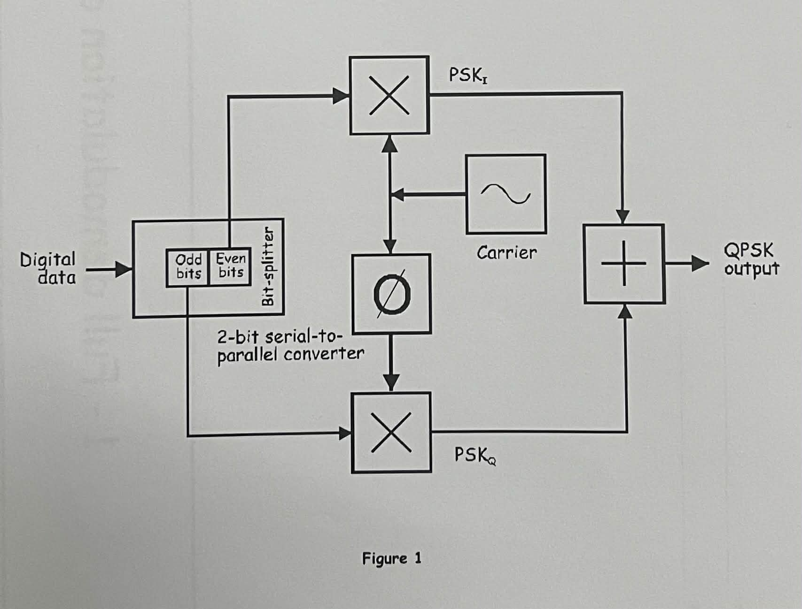
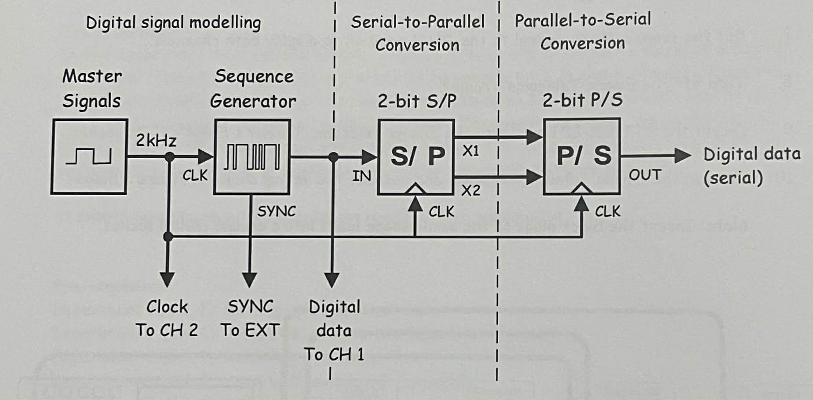
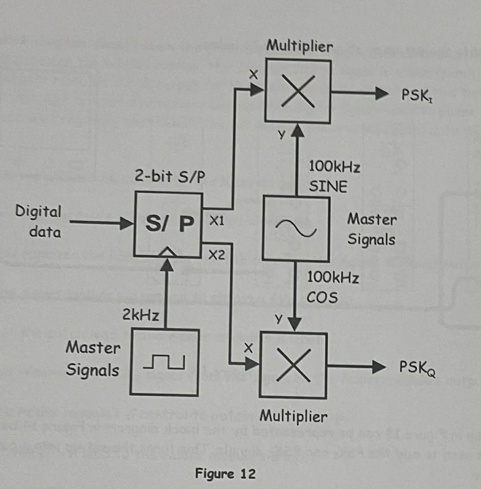
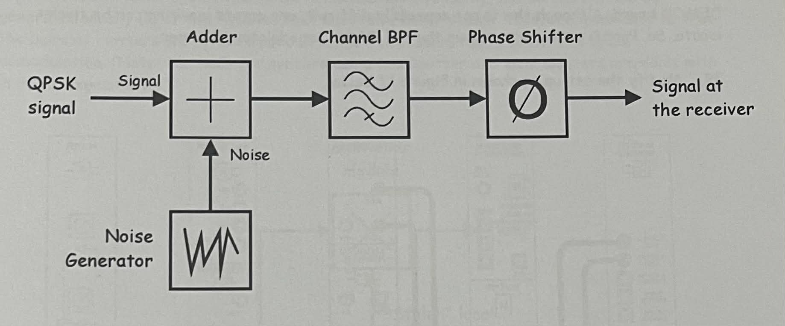
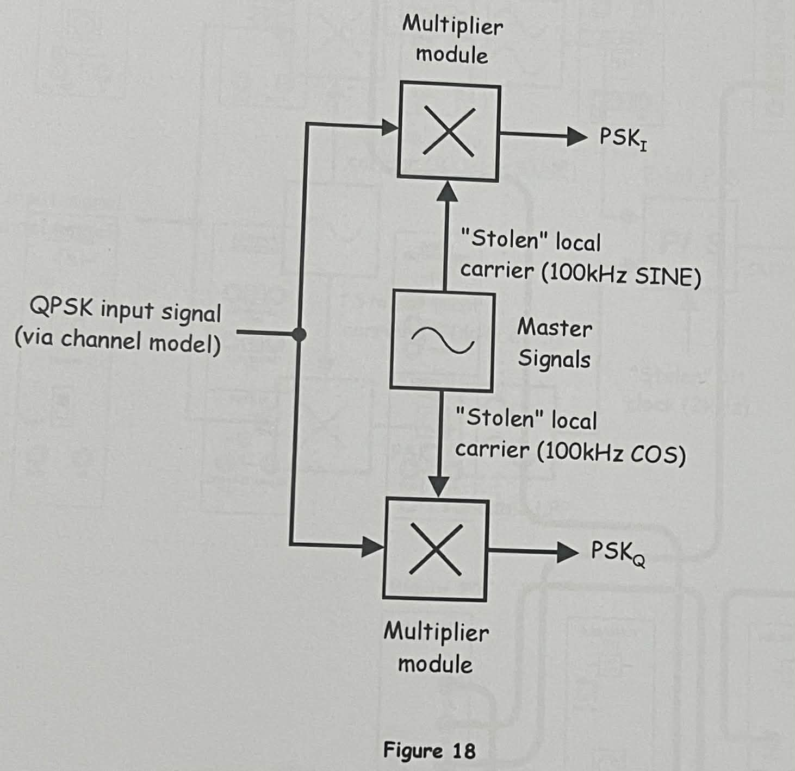
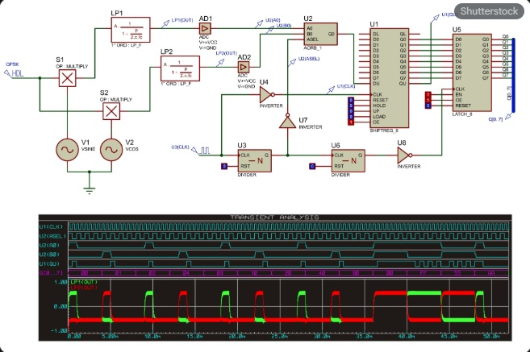
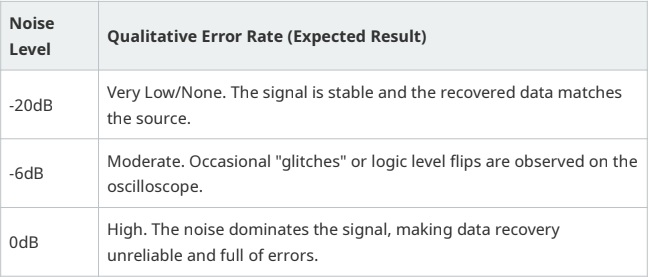

# NEC3202-Laboratory-Report-5
Lab Report 1
_________________________________________________________________________________________________________________________________________________________________________________________________________________________

Lab Report 5 - EXPERIMENT #1 - Full Demodulation of a QPSK Signal 

  
INTRODUCTION:
  
Quadrature Phase Shift Keying (QPSK) is a bandwidth-efficient digital modulation
scheme that transmits two bits per symbol. By utilizing two orthogonal carriers (Sine
and Cosine) of the same frequency, QPSK halves the required radio-frequency
spectrum compared to Binary Phase Shift Keying (BPSK) for the same bit rate. This
experiment explores the generation, channel modeling, and coherent demodulation
of QPSK signals using the Emona Telecoms-Trainer 101.
_________________________________________________________________________________________________________________________________________________________________________________________________________________________

OBJECTIVES:

- To demonstrate serial-to-parallel and parallel-to-serial data conversion.
- To implement a mathematical model of a QPSK modulator.
- To model channel effects including noise and phase shifts.
- To perform full demodulation of a QPSK signal using synchronous detection.
- To analyze the effects of varying signal-to-noise ratios (SNR) on data recovery.
__________________________________________________________________________________________________________________________________________________________________________________________________________________________

SCHEMATIC DIAGRAM:

_________________________________________________________________________________________________________________________________________________________________________________________________________________________

Part A - Verifying Parallel-to-Serial & Serial-to-Parallel Conversion 

This phase involves converting a serial digital stream into two parallel streams and then recombining them. This is the foundation of QPSK, where data is
split to be modulated onto orthogonal carriers. 

Question 1: Are the two data signals the same? Explain your answer.
Yes, the data sequences are identical, but there is a time delay (latency). The delay is
caused by the processing time required for the Serial-to-Parallel and subsequent
Parallel-to-Serial conversion stages, typically offset by a few clock pulses.
________________________________________________________________________________________________________________________________________________________________________________________________________________________

Part B - Generating a QPSK Signal 

A QPSK signal is generated by splitting digital data into even and odd bits. These bits
modulate a 100kHz Sine carrier and a 100kHz Cosine carrier. The
two BPSK signals are then summed to form the QPSK output.

Question 2: Why are the two signals offset in this way?
The signals are offset because the bit-splitter separates the bitstream into two
channels. Since each channel carries every other bit, the symbol duration is doubled,
and the relative phase between the carriers must be maintained at 90° to
ensure orthogonality.
________________________________________________________________________________________________________________________________________________________________________________________________________________________

Part C - Modelling the Channel Conditions 

The channel is modeled as a source of noise and phase shift. This simulates real-
world transmission where signals encounter interference and propagation delays
before reaching the receiver.

________________________________________________________________________________________________________________________________________________________________________________________________________________________

Part D - Full Demodulation of a QPSK Signal 

Demodulation is "phase sensitive." Using two product detectors and "stolen" carriers
from the master signal, the components are recovered. Low-pass filters
(LPF) are used to remove high-frequency products, leaving the original and bitstreams.

Question 4: What are these two digital signals that are recovered?
The signals recovered are the even bits and odd bits streams that were
originally created by the 2-bit Serial-to-Parallel converter at the modulator.

Question 5: How is it possible for the Tuneable LPF to recover either of these
signals?
Because of the 90° phase difference between the carriers. The product detector
rejects the signal because they are orthogonal (the product of a sine and cosine at
the same frequency integrates to zero), allowing the LPF to extract only the baseband
data intended for that specific arm.

Question 7: Why does it matter that the $PSK_I$ arm recovers X1 and $PSK_Q$
recovers X2?
The Parallel-to-Serial converter at the receiver expects the bits in a specific order to
reconstruct the original message. If the arms are swapped, the even and odd bits will
be flipped, resulting in a completely corrupted data stream.

________________________________________________________________________________________________________________________________________________________________________________________________________________________

Part E - Observations of Channel Noise 

Noise is added to the channel at varying levels to observe the qualitative Bit Error
Rate (BER).

_______________________________________________________________________________________________________________________________________________________________________________________________________________________

LEARNINGS: 

Through this experiment, I learned that QPSK effectively doubles the efficiency of the
spectrum by using phase orthogonality. I observed that the accuracy of the local
carrier's phase is critical; even a small phase error can lead to cross-talk between the
channels. Furthermore, the experiment demonstrated that digital
signals are resilient to small amounts of noise (-20dB) but fail rapidly as the noise
power approaches the signal power (0dB).
_______________________________________________________________________________________________________________________________________________________________________________________________________________________
CONCLUSION:

The experiment successfully demonstrated the end-to-end process of QPSK
communication. By using the Emona Telecoms-Trainer, the theoretical concepts of bit-
splitting, orthogonal modulation, and synchronous demodulation were validated. It
was concluded that while QPSK is superior in bandwidth efficiency, its performance is
strictly dependent on carrier synchronization and the Signal-to-Noise Ratio of the
communication channel.
_______________________________________________________________________________________________________________________________________________________________________________________________________________________
